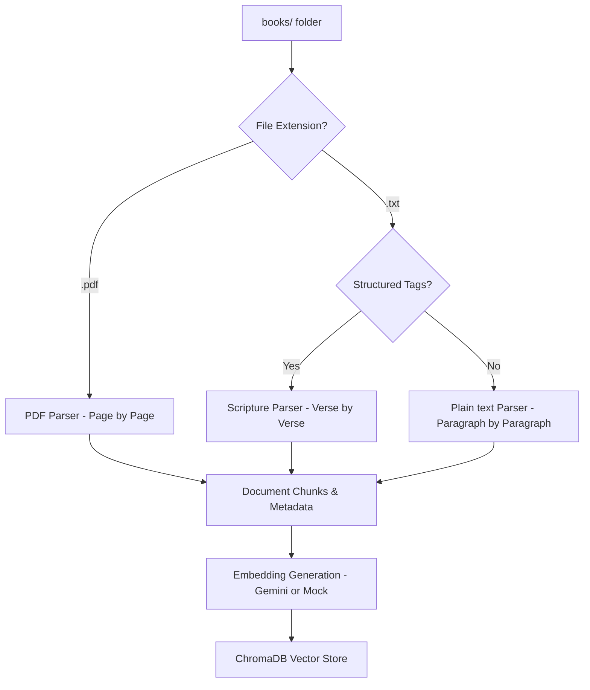
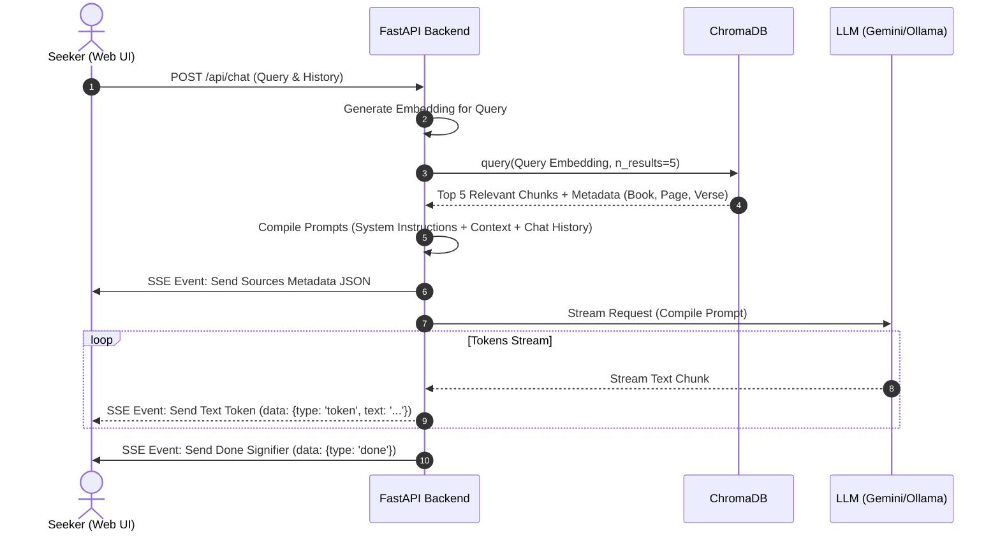

# 🏗️ Architecture Design

AntarJyoti is built on the **Retrieval-Augmented Generation (RAG)** architecture. Instead of relying on fine-tuning, which is expensive and prone to hallucinated citations, RAG extracts relevant passages directly from a database of spiritual texts, feeds them to the LLM as context, and instructs the LLM to write answers backed by those sources.

---

## 🔄 System Workflows

### 1. Ingestion Workflow
When documents are added to the `books/` folder and indexed:

### 2. Chat Query & Retrieval Workflow
When a seeker asks a question:

---

## 🧩 Architectural Components

### 1. Parsing & Chunking Strategies
To preserve the structure of sacred books (which usually consist of specific chapters, pages, or verses), chunking is tailored to the file format:
* **Page-by-page PDF splitting**: Retains page numbers in metadata.
* **Verse-by-verse parsing**: Extracts structured `[Book]`, `[Chapter]`, and `[Verse]` tags to allow exact referencing.
* **Double-newline paragraph splits**: Captures natural paragraph breaks for standard books.

### 2. Vector Store (ChromaDB)
* **Storage**: Persistent SQLite-backed folder (`backend/chroma_db`).
* **Distance Metric**: **Cosine Similarity** (`hnsw:space = cosine`) is used to index vectors. It performs better than Euclidean distance (L2) for semantic text matching.
* **Batching**: Large volumes are chunked into safe batches of `250` records to prevent SQLite variable binding overflow errors.

### 3. LLM Reasoning & Local execution
* **Ollama integration**: Integrates local model endpoints (`http://localhost:11434/api/generate`) using the `requests` library. This streams JSON lines asynchronously.
* **Google Gemini API**: A cloud-based model provider fallback for faster hosting.
* **System Prompting**: Constrains the LLM to the provided context, instructs it to use a peaceful/wise persona, and commands it to cite its sources inline as `[Source #N]`.

### 4. Interactive Citation Badging
* When the backend queries ChromaDB, it sends the raw sources array as the **first event** in the SSE stream.
* The frontend parses the incoming text stream in real-time. Whenever it encounters a text tag like `[Source #1]`, it renders a styled, interactive golden badge.
* Clicking a badge opens a modal displaying the exact excerpt retrieved from the book, bridging the gap between generated text and actual literature.
