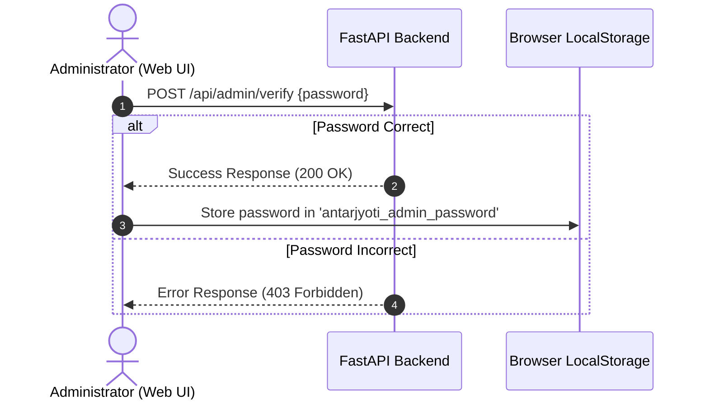
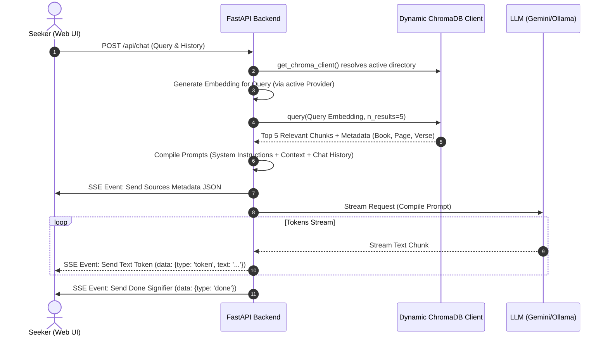

# 🏗️ Architecture Design

AntarJyoti is built on the **Retrieval-Augmented Generation (RAG)** architecture. Instead of relying on fine-tuning, which is expensive and prone to hallucinated citations, RAG extracts relevant passages directly from a database of spiritual texts, feeds them to the LLM as context, and instructs the LLM to write answers backed by those sources.

---

## 🌐 Infrastructure & Deployment Topology

The application is split into a cloud-hosted server tier (Fly.io), a static distribution tier (Vercel CDN), and a local developer tier. The system components operate in two configurations depending on whether you are running locally or using the hosted services.

### Cloud Deployment Topology
This diagram illustrates the production layout where the frontend and backend are completely hosted in the cloud, removing the need for a local server:

```mermaid
graph TD
    subgraph Client ["Client Tier (Browser)"]
        User["Seeker / Administrator"]
        Local["Local Storage (Auth Cache)"]
    end

    subgraph Vercel ["Frontend Hosting (Vercel)"]
        Static["React SPA Bundle (HTML, JS, CSS)"]
    end

    subgraph Fly ["Backend API Hosting (Fly.io VM)"]
        FastAPI["FastAPI Web Server (Uvicorn)"]
        Chroma["ChromaDB Engine (Persistent Client)"]
        subgraph Disk ["Persistent Storage Volume"]
            ChromaFiles["Chroma DB Index Files (/data/chroma_db_backup)"]
        end
    end

    subgraph External ["External Cloud Services"]
        Gemini["Google Gemini API (Reasoning & Embeddings)"]
    end

    %% Network Connections
    User -->|1. Loads Web App| Static
    Static -->|Serves Bundle| User
    User -->|2. HTTP Request / SSE Chat Stream (X-Admin-Password)| FastAPI
    FastAPI -->|3. Query / Write| Chroma
    Chroma -->|4. Reads / Writes Files| ChromaFiles
    FastAPI -->|5. Generate Embeddings & LLM Streaming API| Gemini
    Gemini -->|6. Stream Response| FastAPI
    FastAPI -->|7. Streams SSE Events| User
    User <-->|Local Sessions| Local
```

### Local vs. Cloud Architecture Comparison
The system is highly flexible and can switch execution modes dynamically:

```mermaid
graph LR
    subgraph LocalMode ["Mode 1: Fully Local Mode"]
        BrowserLocal["Local Browser (localhost:5173)"]
        FastAPILocal["Local FastAPI (localhost:8000)"]
        ChromaLocal["Local Chroma DB (./chroma_db_ollama)"]
        Ollama["Local Ollama Service (localhost:11434)"]
        
        BrowserLocal -->|Queries| FastAPILocal
        FastAPILocal -->|Reads Vectors| ChromaLocal
        FastAPILocal -->|Local Inference| Ollama
    end

    subgraph CloudMode ["Mode 2: Cloud-Hosted Mode"]
        BrowserCloud["Public Browser (vercel.app)"]
        FastAPICloud["Fly.io FastAPI (fly.dev)"]
        ChromaVolume["Persistent Volume (/data/chroma_db_backup)"]
        GeminiCloud["Google Gemini Cloud API"]
        
        BrowserCloud -->|Queries (HTTPS)| FastAPICloud
        FastAPICloud -->|Reads Vectors| ChromaVolume
        FastAPICloud -->|Cloud Inference| GeminiCloud
    end
```

---

## 🔄 System Workflows

### 1. Ingestion Workflow
When documents are added to the `books/` folder and indexed, they are read page-by-page as a stream, mapped to vector representations, and written in batches to the active database path.

```mermaid
flowchart TD
    A[books/ folder] --> B{File Extension?}
    B -- .pdf --> C[PDF Parser - Page by Page Stream]
    B -- .txt --> D{Structured Tags?}
    D -- Yes --> E[Scripture Parser - Verse by Verse Stream]
    D -- No --> F[Plain text Parser - Paragraph Stream]
    
    C & E & F --> G[Dynamic Buffer - Batches of 200]
    G --> H[Embedding Generation]
    
    H --> I{Active Provider?}
    I -- gemini --> J[./chroma_db_backup (3072d)]
    I -- ollama --> K[./chroma_db_ollama (768d)]
```

### 2. Admin Authentication Workflow
Sensitive operations (changing settings, executing database clears, and parsing books) are protected by administrative password verification.



### 3. Chat Query & Retrieval Workflow
When a seeker asks a question:



---

## 🧩 Architectural Components

### 1. In-Memory Configuration State (`AppSettings`)
Instead of reading configuration variables from `.env` once at application startup, the backend maintains a mutable `AppSettings` configuration class. This tracks parameters (API keys, Ollama details, and LLM/embedding providers) dynamically. Settings are updated on-the-fly using the `POST /api/settings` endpoint.

### 2. Dynamic Chroma Client Router
Since Gemini embeddings (3072 dimensions) and Ollama embeddings (768 dimensions) are incompatible in the same database collection, the database manager dynamically routes connection requests.
* The system reads the environment variable `CHROMA_DB_DIR` (which defaults to the current directory `.` locally, and `/data` in cloud deployments where a persistent volume is attached).
* **Google Gemini Active**: Resolves database directory to `os.path.join(CHROMA_DB_DIR, "chroma_db_backup")`.
* **Local Ollama Active**: Resolves database directory to `os.path.join(CHROMA_DB_DIR, "chroma_db_ollama")`.
* If a provider swap occurs, the backend dynamically instantiates and caches a new `chromadb.PersistentClient` for the target path. No server restarts are required.

### 3. Ingestion Streaming
To prevent out-of-memory errors on large book folders (such as 100+ MB PDFs), parsing is executed as Python generators (`yield`). Raw text blocks are compiled in small memory buffers of 200 items, sent to the active embedder, saved in the database, and freed immediately.

### 4. Interactive Citation Badging & Fetch Interceptor
* The frontend intercepts standard fetch calls and automatically appends the `X-Admin-Password` header if an administrator session is active.
* When the backend queries ChromaDB, it sends the raw sources array as the **first event** in the SSE stream.
* The frontend parses the incoming text stream in real-time. Whenever it encounters a text tag like `[Source #1]`, it renders a styled, interactive golden badge. Clicking a badge opens a modal displaying the exact excerpt retrieved from the book.
